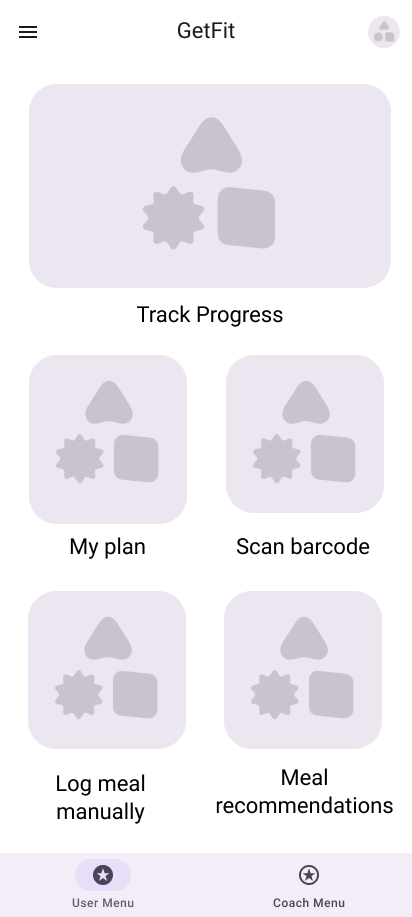
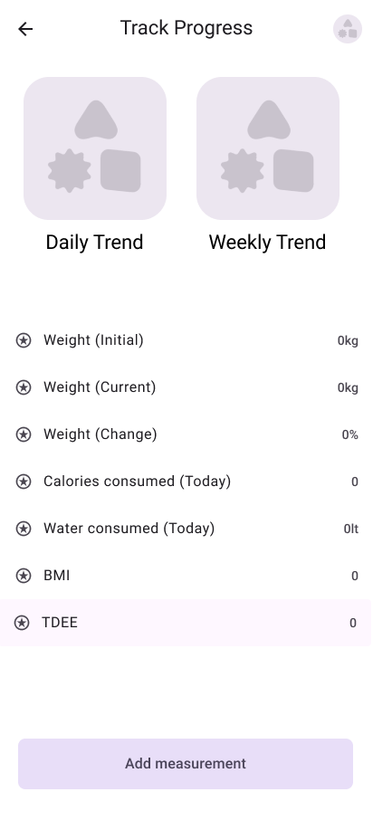

## Project-description-v0.1

To GetFit είναι μια εφαρμογή που βοηθά τους χρήστες να βελτιώσουν την φυσική τους κατάσταση και την διατροφή τους. Οι χρήστες έχουν την δυνατότητα να παρακολουθούν την πρόοδο τους μέσω δεικτών (BMI/TDEE), να καταγράφουν τις προπονήσεις τους και τα γεύματά τους και να θέτουν στόχους. Επίσης θα μπορούν να συγχρονίζουν την πρόοδό τους με το Google Fit, να λαμβάνουν προτάσεις γευμάτων και να αναζητούν χώρους άθλησης μέσω αυτής. Οι Premium χρήστες θα έχουν επιπλέον προσωπική καθοδήγηση από προπονητές οι οποίοι θα τους δημιουργούν ένα πλάνο με βάση τις δικές τους ανάγκες.

Μέλη ομάδας
ΠΑΡΓΙΝΟΣ ΑΛΕΞΑΝΔΡΟΣ up1108402
ΖΑΧΑΡΙΑΔΗΣ ΒΑΣΙΛΕΙΟΣ up1108386
ΡΟΔΟΠΟΥΛΟΣ ΔΗΜΗΤΡΙΟΣ up1112116
ΛΑΓΟΔΗΜΟΣ ΙΩΑΝΝΗΣ up1108381
ΠΟΛΥΜΕΡΟΣ ΠΑΝΑΓΙΩΤΗΣ up1112103

### Mockups

