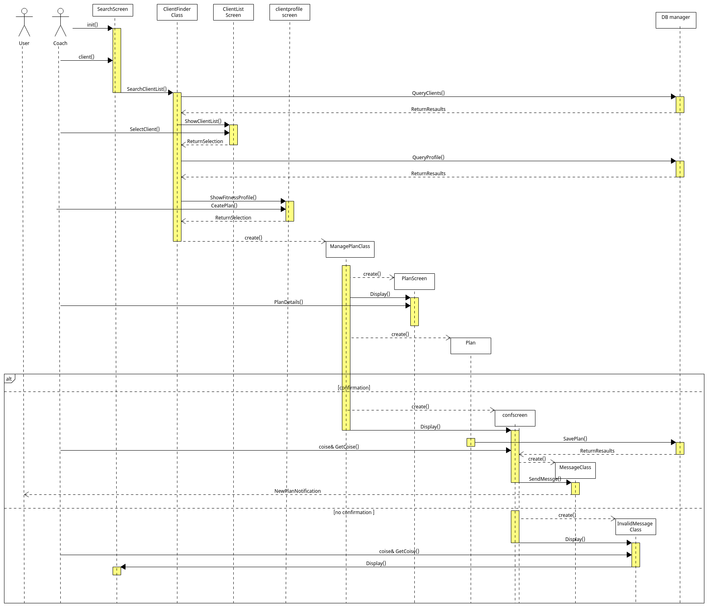
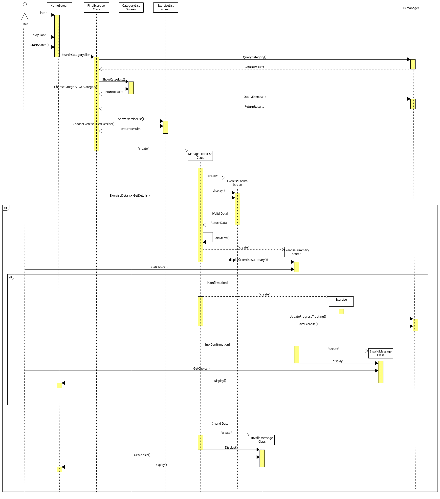
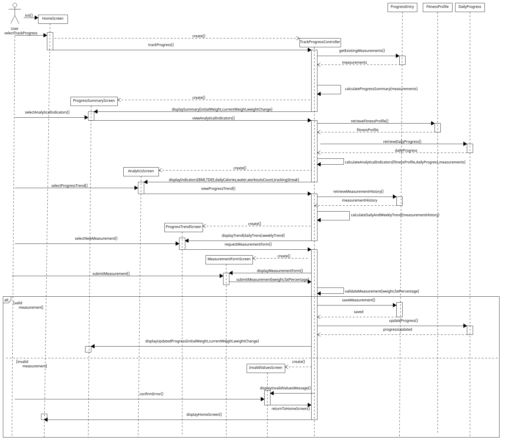
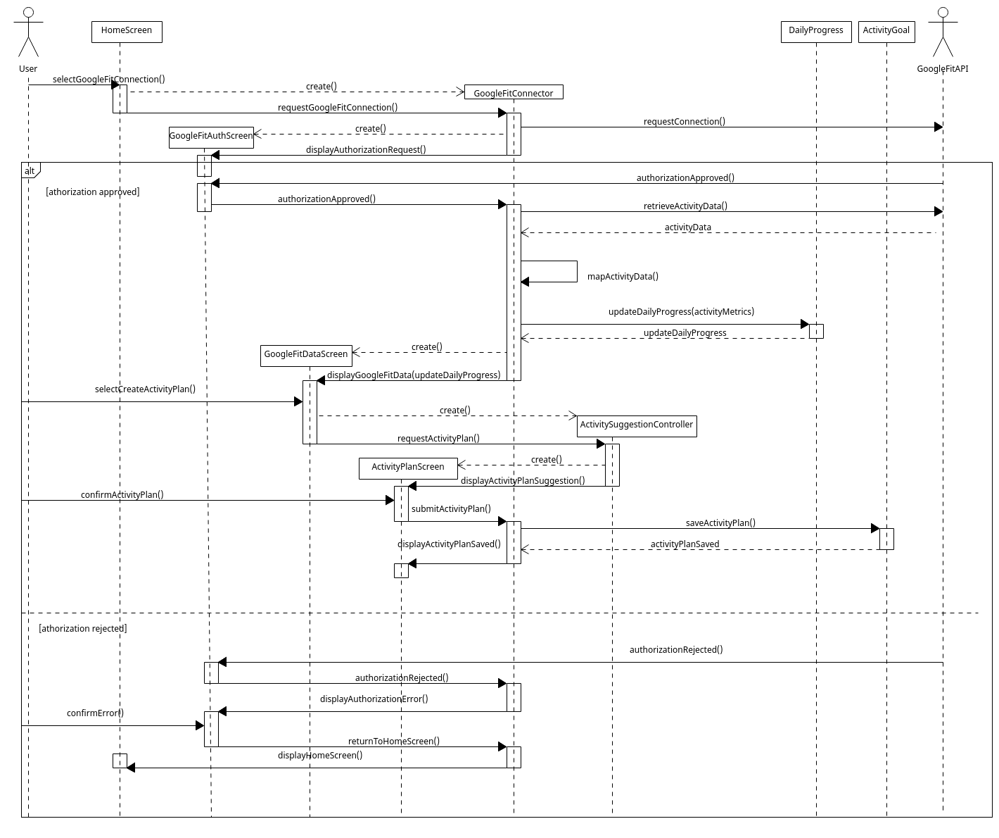
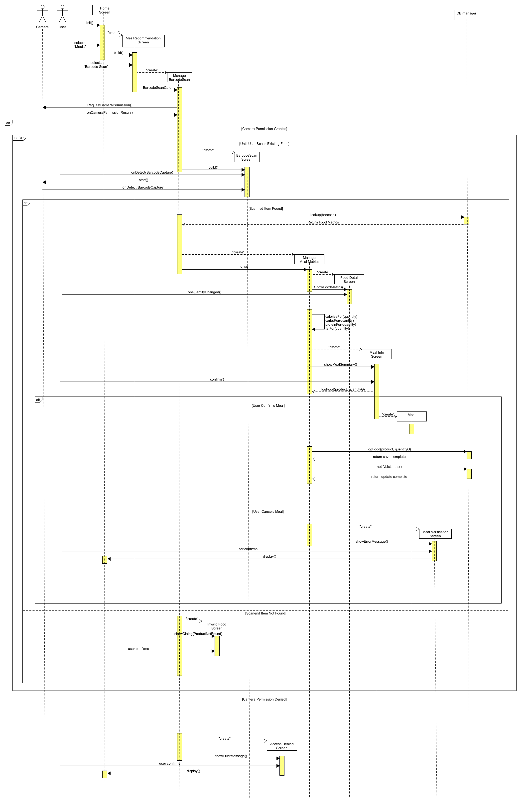
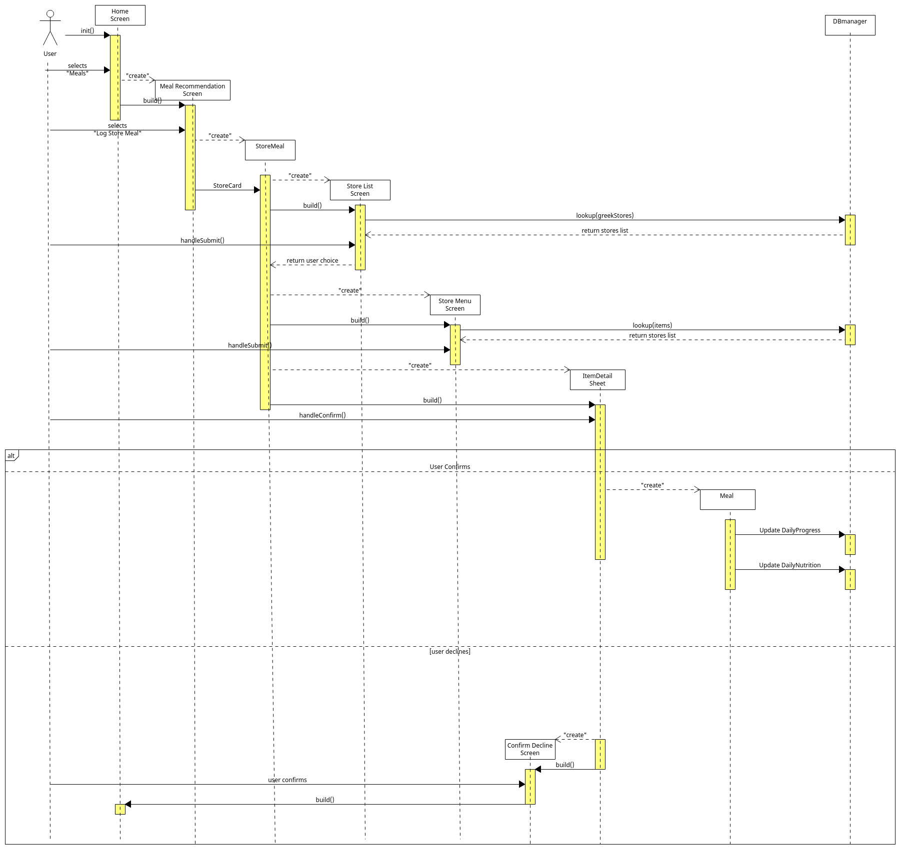
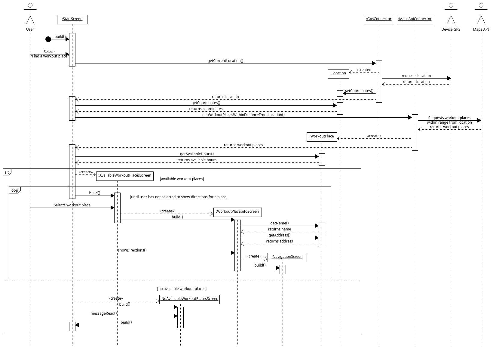
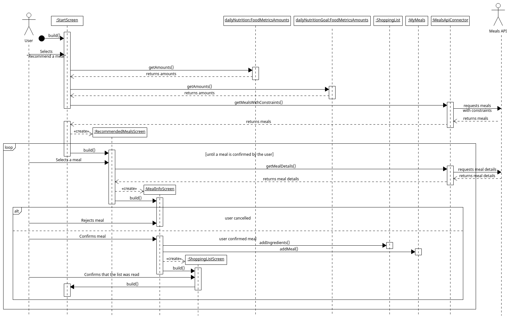
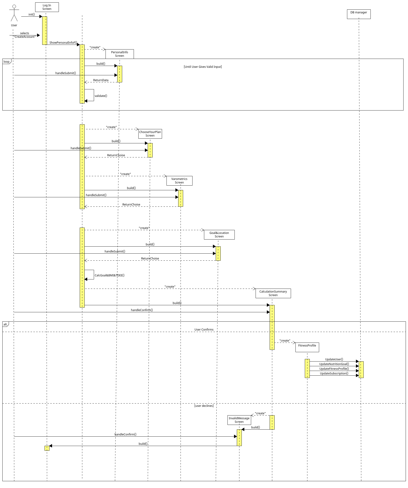
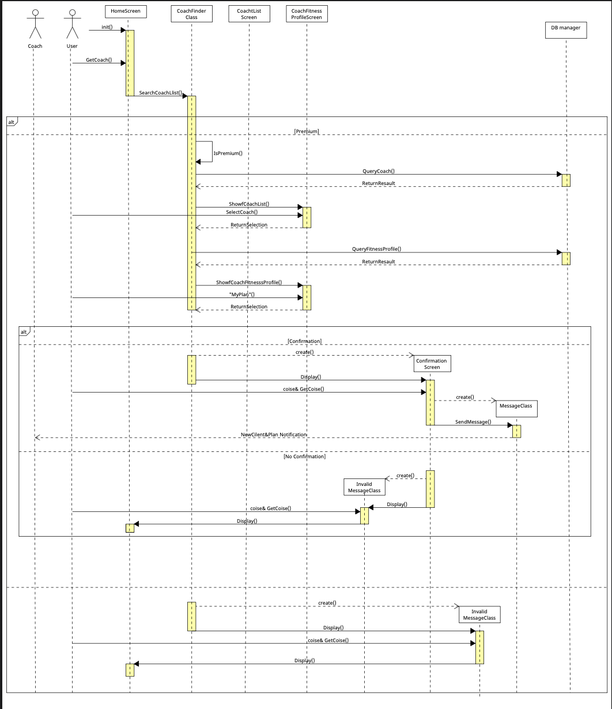

## Sequence diagrams v1.0

USE CASE: Coach Updates / Creates / Assigns plan

Use case: Strength / Cardio Training

USE CASE: Track Progress

USE CASE: Sync with Google Fit and add Weekly Goal

USE CASE: Scan barcode

USE CASE: Log store meal

USE CASE: Search for a workout place and show directions

USE CASE: Meal recommendations

USE CASE: Registration

USE CASE: Get Coach
