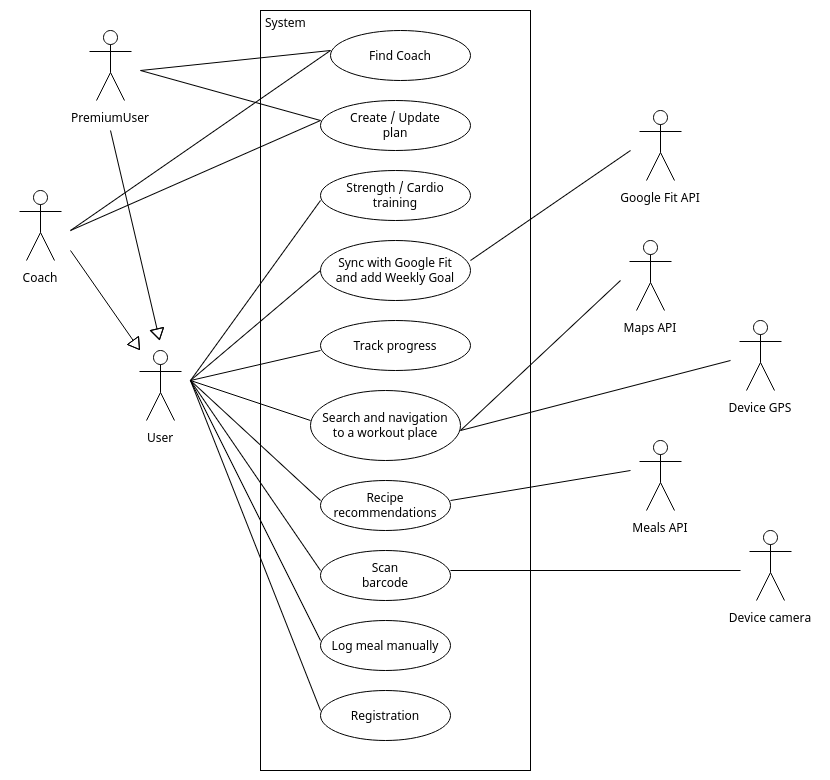

## Use-case-v0.1

Use case diagram

### USE CASE: Create / Update plan

Βασική Ροή
1. Ο Coach επιλέγει την καρτέλα Clients.
2. Το σύστημα του εμφανίζει τη λίστα με τους πελάτες του.
3. Ο Coach επιλέγει έναν πελάτη.
4. Το σύστημα εμφανίζει τους στοχους την πρόοδο και το υπάρχον πλάνο.
5. Ο coach επιλέγει “Create plan“ ή "Update plan".
6. Το σύστημα ανοίγει τη φόρμα επεξεργασίας πλάνου.
7. Ο Coach διαμορφώνει το πλάνο με βάση τον στόχο του πελάτη.
8. Το σύστημα αποθηκεύει το πλάνο και το αναθέτει στο χρήστη και καταγράφεται η ημερομηνία της τελευταίας ενημέρωσης.
9. Το σύστημα ενημερώνει τον πελάτη ότι έλαβε νέο πλάνο.

Εναλλακτική ροή 1
4.a.1 Το σύστημα διαπιστώνει ότι υπάρχει ενεργό αίτημα αλλαγής του τρέχοντος πλάνου από τον χρήστη.
4.a.2 Το σύστημα εμφανίζει το αίτημα αλλαγής μαζί με τους στόχους, την πρόοδο και το υπάρχον πλάνο.
4.a.3 Η περίπτωση χρήσης επιστρέφει στο 6ο βήμα της βασικής ροής.

Εναλλακτική ροή 2
6.a.1 Ο Coach ακυρώνει την επεξεργασία του πλάνου.
6.a.2 Η περίπτωση χρήσης επιστρέφει στο 4ο βήμα της βασικής ροής.

### USE CASE: Strength / Cardio training

Βασική Ροή
1. Ο χρήστης συνδέεται στον λογαριασμό του και επιλέγει “My plan”.
2. Το σύστημα του εμφανίζει τις επιλογές Strength training και Cardio training.
3. O χρήστης επιλέγει μία από τις δύο.
4. Το σύστημα εμφανίζει τη λίστα των δραστηριοτήτων.
5. Ο χρήστης εισάγει τα δεδομένα της άσκησης.
6) Το σύστημα υπολογίζει την εκτιμώμενη κατανάλωση ενέργειας.
7. Το σύστημα εμφανίζει μια σύνοψη της προπόνησης.
8. Ο χρήστης επιβεβαιώνει την καταχώρηση.
9. Το σύστημα αποθηκεύει την προπόνηση και ενημερώνει την πρόοδο του χρήστη.

Εναλλακτική ροή 1
4.α.1 Ο χρήστης έχει ήδη διαθέσιμες ασκήσεις απο τον Coach.
4.a.2 Η περίπτωση χρήσης επιστρέφει στο 6ο βήμα της βασικής ροής.

### USE CASE: Track progress

Βασική Ροή
1. Ο χρήστης επιλέγει "Track progress".
2. Tο σύστημα ανακτά τις μετρήσεις.
3. Το σύστημα εμφανίζει τον αρχικό, τρέχον και μεταβολή βάρους.
4. Το σύστημα υπολογίζει το BMI και TDEE.
5. Το σύστημα εμφανίζει δεδομένα όπως θερμίδες ημέρας, νερό, πλήθος προπονήσεων, tracking streak.
6. Το σύστημα υπολογίζει την τάση προόδου σε εβδομαδιαία και ημερήσια βάση.
7. Ο χρηστης εισάγει νεα μέτρηση βάρους και ποσοστού λίπους.
8. Το σύστημα αποθηκεύει τις μετρήσεις και ενημερώνει την πρόοδο.

Εναλλακτική ροή 1
7.a.1 O χρήστης εισάγει μη έγκυρες τιμές.
7.a.2 Tο σύστημα ενημερώνει τον χρήστη ότι οι τιμές δεν είναι έγκυρες.
7.a.3 Η περίπτωση χρήσης επιστρέφει στο 7ο βήμα της βασικής ροής.

### USE CASE: Sync with Google Fit and add Weekly Goal

Βασική Ροή
1. Ο χρήστης επιλέγει να σύνδεθεί με το Google Fit.
2. Το σύστημα ζητά εξουσιοδότηση πρόσβασης.
3. Ο χρήστης εγκρίνει τη σύνδεση.
4. Το σύστημα ανακτά τα δεδομένα από το Google Fit Activity.
5. Το σύστημα αντιστοιχίζει τα δεδομένα σε βήματα, διάρκεια κίνησης, θερμίδες και άλλες μετρήσεις.
6. Το σύστημα ενημερώνει την ημερίσια πρόοδο.
7. Ο χρήστης επιλέγει δημιουργία εβδομαδιαίου στόχου.
8. Το σύστημα αποθηκεύει τον εβδομαδιαίο στόχο.

Εναλλακτική ροή 1
3.a.1 : Ο χρήστης απορρίπτει την εξουσιοδότηση πρόσβασης στο Google Fit.
3.a.2 : Το σύστημα ενημερώνει το χρήστη ότι δεν μπορεί να ολοκληρωθεί η σύνδεση χωρίς την έγκριση πρόσβασης.
3.a.3 : Η περίπτωση χρήσης επιστρέφει στο 2ο βήμα της βασικής ροής.

### USE CASE: Scan barcode

Βασική Ροή
1. Ο χρήστης επιλέγει "Scan barcode".
2. Το σύστημα ζητά άδεια πρόσβασης στην κάμερα της συσκευής.
3. Ο χρήστης σκανάρει το barcode.
4. Το σύστημα κάνει αναάγνωση του κωδικού προιόντος.
5. Το σύστημα αναζητά το προιόν και δείχνει τα διατροφικά στοιχεία του.
6. Ο χρήστης δηλώνει ποσότητα κατανάλωσης.
7. Το σύστημα υπολογίζει τα calories και macros.
8. Ο χρήστης επιβεβαιώνει την προσθήκη.
9. Το σύστημα ενημερώνει τα ημερήσια στατιστικά προόδου.
10. Ο χρήστης επιλέγει αν θέλει να αποθηκεύσει το γεύμα για μελλοντική χρήση.

### USE CASE: Log meal manually

Βασική Ροή
1. O χρήστης επιλέγει "Log meal manually".
2. Ο χρήστης επιλέγει τύπο γεύματος.
3. Το σύστημα εμφανίζει τη φόρμα καταχώρησης γεύματος.
4. Ο χρήστης αναζητά τα γεύματα.
5. Το συστημα εμφανίζει αντιστοιχίες.
6. Ο χρήστης επιλέγει απο τις αντιστοιχίες και επιλέγει την ποσότητα.
7. Το σύστημα υπολογίζει τις θερμίδες και macros του τροφίμου.
8. Ο χρήστης επιλέγει πως δεν θέλει να προσθέσει άλλο τρόφιμο και ολοκληρώνει το γεύμα.
9. Το σύστημα υπολογίζει τα συνολικά θρεπτικά συστατικά του γεύματος.
10. Ο χρήστης επιβεβαιώνει την ανάλυση του γεύματος.
11. Το σύστημα ενημερώνει την ημερήσια πρόοδο και αποθηκεύει το γεύμα.
12. Ο χρηστης αποθηκεύει το γεύμα για μελλοντική χρήση.

### USE CASE: Search and navigation to a workout place

Βασική Ροή
1. Ο χρήστης επιλέγει την "Find a workout place".
2. Το σύστημα ζητά από το GPS της συσκευής την τοποθεσία.
3. Το GPS της συσκευής δίνει στο σύστημα την τοποθεσία.
4. Το σύστημα ζητά τους κοντινούς χώρους άθλησης από το API του χάρτη.
5. Το σύστημα φιλτράρει τους χώρους που δεν είναι ανοιχτοί την τρέχουσα ώρα.
6. To σύστημα εμφανίζει τη λίστα με τους διαθέσιμους χώρους.
7. Ο χρήστης επιλέγει έναν από τους διαθέσιμους χώρους.
8. Το σύστημα εμφανίζει πληροφορίες σχετικά με τον συγκεκριμένο χώρο.
9. Ο χρήστης επιλέγει "Directions".
10. Το σύστημα εμφανίζει οδηγίες στον χρήστη για την διαδρομή.

Εναλλακτική ροή 1
6.α.1 Το σύστημα ενημερώνει τον χρήστη ότι την τρέχουσα ώρα δεν υπάρχει κοντινός χώρς άθλησης διαθέσιμος.
6.α.2 Ο χρήστης επιβεβαιώνει ότι διάβασε το μήνυμα.
6.α.3 Το σύστημα δείχνει στον χρήστη την Κύρια Οθόνη.

### USE CASE: Meal recommendations

Βασική Ροή
1. Ο χρήστης επιλέγει "Meal recommendations".
2. Το σύστημα υπολογίζει τα θρεπτικά συστατικά που ο χρήστης πρέπει να καταναλώσει επιπλέον με βάσει τους στόχους του και τη διατροφή του τη συγκεκριμένη μέρα.
3. Το σύστημα ζητά από το Meals API, γεύματα που περιέχουν τα υπολοιπόμενα στοιχεία.
4. Το σύστημα εμφανίζει στον χρήστη τα προτεινόμενα γεύματα.
5. Ο χρήστης επιλέγει ένα γεύμα.
6. Το σύστημα δείχνει επιπλέον πληροφορίες για το γεύμα στον χρήστη (τα συστατικά που περιέχει, τη διατροφική αξία).
7. Ο χρήστης επιβεβαιώνει ότι θα προετοιμάσει το γεύμα.
8. Το σύστημα προσθέτει το γεύμα στη λίστα αγορών.
9. Το σύστημα αποθηκεύει το γεύμα στο "My meals".
10. Το σύστημα εμφανίζει στον χρήστη τη λίστα αγορών.

Εναλλακτική ροή 1
7.α.1 Ο χρήστης απορρίπτει το επιλεγμένο γεύμα.
7.α.2 Η περίπτωση χρήσης επιστρέφει στο 4ο βήμα της βασικής ροής.

### USE CASE: Registration

Βασική Ροή
1. Ο χρήστης επιλέγει "Register"
2. Το σύστημα εμφανίζει την φόρμα εγγραφής.
3. Ο χρήστης εισάγει όνομα χρήστη, email και κωδικό.
4. Το σύστημα επιβεβαιώνει την ορθότητα των στοιχείων.
5. Ο χρήστης επιλέγει τον τύπο λογαριασμού (Premium ή Free).
6. Ο χρήστης εισάγει βασικά στοιχεία για το προφίλ του (ηλικία, βάρος, φύλο, ύψος, ποσοστό λίπους)
7. Ο χρήστης επιλέγει στόχο (απώλεια βάρους, αύξηση μυικής μάζας, συντήρηση) και επίπεδο δραστηριότητας και προτιμήσεις προπόνησης (weightlifting, cardio ή κα τα δύο).
8. Το σύστημα υπολογίζει τον ιδεατό ρυθμό μεταβολής σύμφωνα με τον στόχο.
9. Ο χρήστης αποδέχεται τον προτεινόμενο ρυθμο.
10. Το σύστημα υπολογίζει και εμφανίζει το BMI και το TDEE.
11. Το σύστημα δημιουργέι τον λογαριασμό του χρηήτη και το προφίλ φυσικής και διατροφικής κατάστασής του.
12. Το σύστημα μεταφέρει τον χρήστη στην αρχική οθόνη.

Εναλλακτική ροή 1
2.α.1 Τα στοιχεία δεν είναι έγκυρα και το σύστημα τα απορρίπτει.
2.α.2 Η περίπτωση χρήσης επιστρέφει στο 2ο βήμα της βασικής ροής.

Εναλλακτική ροή 2
9.α.1 Ο χρήστης αλλάζει τον ρυθμό μεταβολής.
9.α.2 Η περίπτωση χρήσης επιστρέφει στο 10ο βήμα της βασικής ροής.

### USE CASE: Find Coach

Βασική Ροή
1. Ο χρήστης επιλέγει "Find a Coach".
2. Το σύστημα ελέγχει αν ο λογαριασμός είναι Premium.
3. Το σύστημα εμφανίζει λιστα διαθέσιμων Coaches.
4. Ο χρήστης επιλέγει έναν Coach.
5. Το σύστημα εμφανίζει το πλήρες προφίλ του Coach.
6. Το σύστημα αναθέτει τον Coach τον χρήστη.
7. Tο σύστημα ενημερώνει τον Coach για την ανάθεση του.
8. To συστημα ξεκλειδώνει την καρτελα "My plan" για τον χρήστη.
