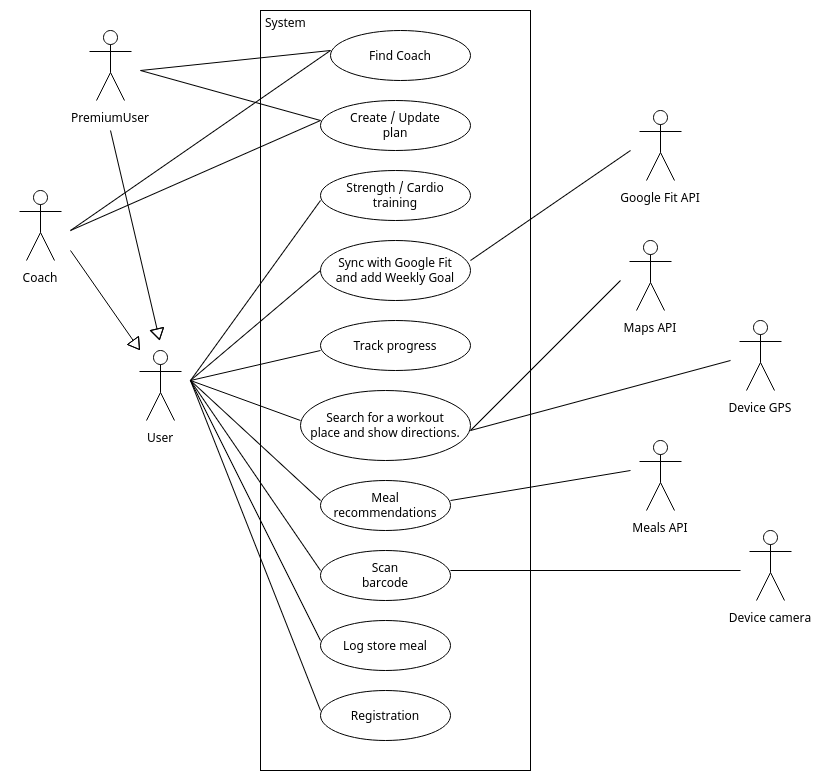

## Use-case-v1.0

Use case diagram

### USE CASE:  Coach Updates / Creates / Assigns plan

Βασική ροή

1. O coach επιλέγει “Clients” στην Αρχική Οθόνη.
2. Tο σύστημα  εμφανίζει στον coach την λίστα με τους πελάτες του.
3. O coach επιλέγει τον πελάτη που θέλει.
4. Tο σύστημα εμφανίζει το fitness profile του πελατη.
5. O coach επιλέγει την “Δημιουργία Πλάνου” ή "Ενημερωση Πλάνου".
6. Tο σύστημα εμφανίζει φόρμα δημιουργίας πλάνου.
7. O coach δημιουργεί το πλάνο.
8. Tο σύστημα ζητά από τον coach επιβεβαίωση.
9. O coach επιβεβαιώνει την δημιουργία.
10. Tο σύστημα αποθηκεύει το πλάνο και ενημερώνει τον χρήστη.

Εναλλακτική ροή:

8.1 Ο coach δεν κάνει επιβεβαίωση πλάνου.
8.2 Το σύστημα ενημερώνει τον coach οτι δεν μπορεί να συνεχίσει χωρίς επιβεβαίωση. 
8.3 Ο coach επιβεβαιώνει ότι διάβασε το μήνυμα.
8.4 Το σύστημα εμφανίζει στον coach την Αρχική Οθόνη. 

### Use case: Strength / Cardio Training 

Βασική ροή

1. Ο χρήστης επιλέγει“My plan” στην Αρχική Οθόνη.
2. Το σύστημα  εμφανίζει στον χρήστη τις κατηγορίες ασκήσεων.
3. Ο χρήστης επιλέγει την κατηγορία που θέλει.
4. Το σύστημα του εμφανίζει την λίστα των ασκήσεων .
5. Ο χρήστης επιλέγει την άσκηση.
6. Το σύστημα του εμφανίζει την φόρμα στοιχείων άσκησης.
7. Ο χρήστης συμπληρώνει τις πληροφορίες άσκησης (πχ set, επαναλήψεις ).
8. Το σύστημα υπολογίζει την εκτιμώμενη κατανάλωση ενέργειας.
9. Το σύστημα εμφανίσει την σύνοψη προπόνησης.
10. Ο χρήστης επιβεβαιώνει την καταχώριση.
11. Το σύστημα αποθηκεύει την προπόνηση και ενημερώνει την πρόοδο του χρήστη.

Εναλλακτικές ροές :

7.1 Ο χρήστης εισάγει λανθασμένες τιμές. 
7.2 Το σύστημα ενημερώνει τον χρήστη ότι έχει εισάγει λανθασμένες τιμές. 
7.3 Ο χρήστης επιβεβαιώνει ότι διάβασε το μήνυμα.
7.4 Το σύστημα εμφανίζει στον χρήστη την φόρμα στοιχείων άσκησης.

9.1 Ο χρήστης δεν κάνει  επιβεβαίωση σύνοψης προπόνησης.
9.2 Το σύστημα ενημερώνει τον χρήστη ότι δεν μπορεί να συνεχίσει χωρίς επιβεβαίωση. 
9.3 Ο χρήστης επιβεβαιώνει ότι διάβασε το μήνυμα.
9.4 Το σύστημα εμφανίζει στον χρήστη την Αρχική Οθόνη. 

### USE CASE: Track Progress

Βασική Ροή : 
1. Ο χρήστης επιλέγει “Track progress”.
2. Το σύστημα ανακτά τις υπάρχουσες μετρήσεις.
3. Το σύστημα εμφανίζει σύνοψη προόδου με αρχικό βάρος, τρέχον βάρος και μεταβολή βάρους.
4. Ο χρήστης επιλέγει προβολή αναλυτικών δεικτών.
5. Το σύστημα υπολογίζει και εμφανίζει BMI, TDEE, θερμίδες ημέρας, νερό, πλήθος προπονήσεων και tracking streak.
6. Ο χρήστης επιλέγει προβολή τάσης προόδου.
7. Το σύστημα υπολογίζει και εμφανίζει την ημερήσια και εβδομαδιαία τάση προόδου.
8. Ο χρήστης επιλέγει καταχώριση νέας μέτρησης.
9. Ο χρήστης εισάγει νέα μέτρηση βάρους και ποσοστού λίπους.
10. Το σύστημα ελέγχει την εγκυρότητα της μέτρησης.
11. Το σύστημα αποθηκεύει τη νέα μέτρηση και ενημερώνει την πρόοδο.

Εναλλακτική Ροή: 
10.a.1 Ο χρήστης εισάγει μη έγκυρες τιμές.
10.a.2 Το σύστημα ενημερώνει τον χρήστη ότι οι τιμές δεν είναι έγκυρες.
10.a.3 Η περίπτωση χρήσης επιστρέφει στο βήμα 9 της βασικής ροής.

### USE CASE: Sync with Google Fit and add Weekly Goal

Βασική Ροή : 
1. Ο χρήστης επιλέγει να σύνδεθεί με το Google Fit.
2. Το σύστημα ζητά εξουσιοδότηση πρόσβασης.
3. To GoogleFit παρεχει δεδομένα στο σύστημα

4. Το σύστημα αντιστοιχίζει τα δεδομένα σε βήματα, διάρκεια κίνησης, θερμίδες και
άλλες μετρήσεις και τα εμφανίζει.
5. Το σύστημα ενημερώνει την ημερίσια πρόοδο.
6. Ο χρήστης επιλέγει δημιουργία πλάνου.
7. Το σύστημα προτείνει εβδομαδιαίο στοχο με βάση το Fitness Profile και τα δεδομενα
8. Ο χρήστης επιβεβαιώνει τον στόχο
9. Το σύστημα αποθηκεύει τον εβδομαδιαίο στόχο.

Εναλλακτικές ροές : 
3.a.1 : Δεν παρέχεται η απαραίτητη εξουσιοδότηση για τα δεδομένα.
3.a.2 : Εμφανίζεται μήνυμα αποτυχίας στον χρήστη.
3.a.3 : Επιστρέφουμε στην Αρχική Οθόνη. 

8.a.1 : Ο χρήστης δεν επιβεβαιώνει τον προτεινόμενο εβδομαδιαίο στόχο.
8.a.2 : Το σύστημα εμφανίζει μήνυμα αποτυχίας επιβεβαίωσης στόχων.
8.a.3 : Επιστρέφουμε στην Αρχική Οθόνη.

### USE CASE: Scan barcode

Βασική Ροή
1. Ο χρήστης επιλέγει "Scan barcode".
2. Το σύστημα ζητά άδεια πρόσβασης στην κάμερα της συσκευής.
3. Ο χρήστης σκανάρει το barcode.
4. Το σύστημα κάνει αναάγνωση του κωδικού προιόντος.
5. Το σύστημα αναζητά το προιόν και δείχνει τα διατροφικά στοιχεία του.
6. Ο χρήστης δηλώνει ποσότητα κατανάλωσης.
7. Το σύστημα υπολογίζει τα calories και macros.
8. Ο χρήστης επιβεβαιώνει την προσθήκη.
9. Το σύστημα ενημερώνει τα ημερήσια στατιστικά προόδου.
10. Ο χρήστης επιλέγει αν θέλει να αποθηκεύσει το γεύμα για μελλοντική χρήση.

### USE CASE: Log store meal
1. Ο χρήστης επιλέγει "log store meal".
2. Το σύστημα ανακτά την πόλη του χρήστη από fitnessProfile.
3. Το σύστημα εμφανίζει τη λίστα των καταστημάτων.
4. Ο χρήστης επιλέγει κάταστημα.
5. Το σύστημα εμφανίζει το menu του καταστηματος.
6. Ο χρήστης επιλέγει το φαγητό.
7. Το σύστημα ανακτά και εμφανίζει τις τροφικές αξίες του γεύματος.
8. Ο χρήστης επιβεβαιώνει την αποθήκευση γεύματος.
9. Το σύστημα ενημερώνει το dailyProgress και dailyNutrition.

### USE CASE: Search for a workout place and show directions.

Βασική Ροή
1. Ο χρήστης επιλέγει την "Find a workout place" στην αρχική οθόνη.
2. Το σύστημα ζητά από το GPS της συσκευής την τοποθεσία.
3. Το GPS της συσκευής δίνει στο σύστημα την τοποθεσία.
4. Το σύστημα ζητά τους κοντινούς χώρους άθλησης από το API του χάρτη.
5. Το σύστημα φιλτράρει τους χώρους που δεν είναι ανοιχτοί την τρέχουσα ώρα.
6. To σύστημα εμφανίζει τη λίστα με τους διαθέσιμους χώρους.
7. Ο χρήστης επιλέγει έναν από τους διαθέσιμους χώρους.
8. Το σύστημα εμφανίζει πληροφορίες σχετικά με τον συγκεκριμένο χώρο.
9. Ο χρήστης επιλέγει "Directions".
10. Το σύστημα εμφανίζει οδηγίες στον χρήστη για την διαδρομή.

Εναλλακτική ροή 1
6.α.1 Το σύστημα ενημερώνει τον χρήστη ότι την τρέχουσα ώρα δεν υπάρχει κοντινός χώρς άθλησης διαθέσιμος.
6.α.2 Ο χρήστης επιβεβαιώνει ότι διάβασε το μήνυμα.
6.α.3 Το σύστημα δείχνει στον χρήστη την Αρχική Οθόνη.

Εναλλακτική ροή 2
9.α.1 Ο χρήστης επιλέγει "Cancel".
9.α.2 Η περίπτωση χρήσης επιστρέφει στο 6ο βήμα της βασικής ροής.

### USE CASE: Meal recommendations

Βασική Ροή
1. Ο χρήστης επιλέγει "Meal recommendations" στην αρχική οθόνη.
2. Το σύστημα υπολογίζει τα θρεπτικά συστατικά που ο χρήστης πρέπει να καταναλώσει επιπλέον με βάσει τους στόχους του και τη διατροφή του τη συγκεκριμένη μέρα.
3. Το σύστημα ζητά από το Meals API, γεύματα που περιέχουν τα υπολοιπόμενα στοιχεία.
4. Το σύστημα εμφανίζει στον χρήστη τα προτεινόμενα γεύματα.
5. Ο χρήστης επιλέγει ένα γεύμα.
6. Το σύστημα δείχνει επιπλέον πληροφορίες για το γεύμα στον χρήστη (τα συστατικά που περιέχει, τη διατροφική αξία).
7. Ο χρήστης επιβεβαιώνει το γεύμα.
8. Το σύστημα προσθέτει τα υλικά του γεύματος στη λίστα αγορών.
9. Το σύστημα αποθηκεύει το γεύμα στο "My meals".
10. Το σύστημα εμφανίζει στον χρήστη τη λίστα αγορών.
11. Ο χρήστης επιβεβαιώνει ότι διάβασε τη λίστα.
12. Το σύστημα εμφανίζει στον χρήστη την αρχική οθόνη.

Εναλλακτική ροή 1
7.α.1 Ο χρήστης απορρίπτει το επιλεγμένο γεύμα.
7.α.2 Η περίπτωση χρήσης επιστρέφει στο 4ο βήμα της βασικής ροής.

### USE CASE: Registration

Βασική ροή

1. Ο χρήστης επιλέγει “Create a new account” στην Οθόνη Εγγραφής.
2. Το Σύστημα εμφανίζει την φόρμα προσωπικών στοιχείων.
3. Ο χρήστης εισάγει όνομα , email, κωδικό.
4. Το σύστημα κάνει validity check των πεδιων.
5. Το σύστημα εμφανίζει φόρμα επιλογής πλάνου. 
6. Ο χρήστης επιλέγει τύπο πλάνου που επιθυμεί.
7. Το σύστημα αποθηκεύει τον τύπο πλάνου και εμφανίζει την φόρμα βαρομετρικών.
8. Ο χρήστης εισάγει τα βαρομετρικά του στοιχεία.
9. Το σύστημα αποθηκεύει τα στοιχεία και εμφανίζει την φόρμα στόχου και τοποθεσίας.
10. Ο χρήστης εισάγει τον επιθυμητό στόχο και την τοποθεσία του.
11. Το σύστημα υπολογίζει και εμφανίζει τον ιδεατό ρυθμό μεταβολής μαζί με το BMI και TDEE.
12. Ο χρήστης επιβεβαιώνει τους υπολογισμούς.
13. Το σύστημα αποθηκεύει τα στοιχεία του χρήστη και δημιουργεί το FitnessProfile του.

Εναλλακτικές ροές:

4.1 Ο χρήστης εισάγει λανθασμένες τιμές. 
4.2 Το σύστημα εμφανίζει στον χρήστη την φόρμα προσωπικών στοιχείων.

12.1 Ο χρήστης δεν κάνει  επιβεβαίωση του ιδεατου ρυθμού μεταβολής, BMI και TDEE.
12.2 Το σύστημα ενημερώνει τον χρήστη ότι δεν μπορεί να συνεχίσει χωρίς επιβεβαίωση. 
12.3 Ο χρήστης επιβεβαιώνει ότι διάβασε το μήνυμα.
12.4 Το σύστημα εμφανίζει στον χρήστη την Αρχική Οθόνη. 

### USE CASE: Get Coach

Βασική ροή

1. Ο χρήστης επιλέγει “GetCoach” στην Αρχική Οθόνη.
2. Το σύστημα ελέγχει αν ο λογαριασμός είναι premium.
3. Το σύστημα εμφανίζει την λίστα διαθέσιμων coaches.
4. Ο χρήστης επιλέγει τον coach που θέλει.
5. Το σύστημα εμφανίζει στον χρήστη το FitnessProfile του coach.
6. Ο χρήστης επιλέγει “MyPlan”.
7. Το σύστημα ζητά από τον χρήστη επιβεβαίωση.
8. Ο χρήστης  επιβεβαιώνει το αίτημα πλάνου.
9. Το σύστημα ενημερώνει τον coach για τον νέο πελάτη και την δημιουργα νέου πλάνου.

Εναλλακτικές ροές:

2.1 Ο χρήστης δεν είναι premium.
2.2 Το σύστημα ενημερώνει τον χρήστη ότι δεν μπορεί να συνεχίσει επειδή δεν είναι premium. 
2.3 Ο χρήστης επιβεβαιώνει ότι διάβασε το μήνυμα.
2.4 Το σύστημα εμφανίζει στον χρήστη την Αρχική Οθόνη. 

8.1 Ο χρήστης δεν κάνει  επιβεβαίωση του αιτήματος πλάνου. 
8.2 Το σύστημα ενημερώνει τον χρήστη ότι δεν μπορεί να συνεχίσει χωρίς επιβεβαίωση. 
8.3 Ο χρήστης επιβεβαιώνει ότι διάβασε το μήνυμα.
8.4 Το σύστημα εμφανίζει στον χρήστη την Αρχική Οθόνη.
